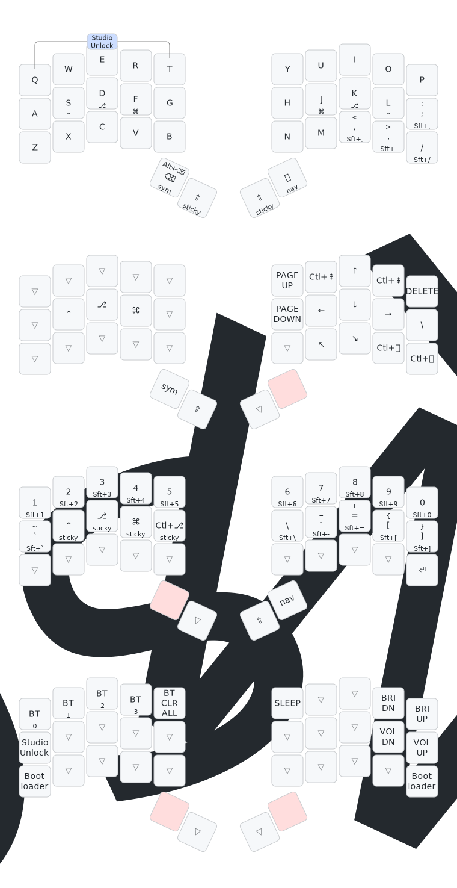

# Forager Acid (Partial Heawood) Firmware

This is firmware for a Bluetooth capable Seeed Studio Xiao nRF25840 (aka Xiao BLE)
controller split 34 key design (split 3x5_2 - three rows of five, and two thumb
keys, for each hand) - my alternative PCB for the [Forager keyboard](https://github.com/carrefinho/forager/pull/20).
This is a *diode-free* design with a sparse 7 by 6 scanning matrix designed using the
[Partial Heawood Graph](https://houseofgraphs.org/graphs/54325) (using all 13 GPIOs).
This is a bipartite graph with 7 (scanning rows) plus 6 (scanning columns) giving 13
vertices, and 18 edges (keys). The graph is girth 6, meaning sadly the keyboard has
only 4-key roll-over. See this
[blog post](https://astrobeano.blogspot.com/2025/05/topology-meets-custom-keyboard-circuit.html)
for background.

This matrix shows the full 7×6 Partial Heawood Graph bipartite matrix,
mirrored left and right in the ZMK firmware as a 7x12 sparse scanning matrix.
The physical keyboard columns (counting the thumb keys on each hand as columns)
are mapped to the scanning columns, but the scanning rows are arbitary.

| GPIO| P0.10 | D7 | D8 | D9 | P0.09 | D10 | D10 | P0.09 | D9 | D8 | D7 | P0.10 |
|:----|:-----:|:--:|:--:|:--:|:-----:|:---:|:---:|:-----:|:--:|:--:|:--:|:-----:|
| D5  |   Q   |    |    |  R |   T   |     |     |   Y   |  U |    |    |   P   |
| D6  |       |    |  E |  F |       |     |     |       |  J |  I |    |       |
| D2  |       |  W |  D |    |   G   |     |     |   H   |    |  K |  O |       |
| D1  |   A   |  S |    |    |       |     |     |       |    |    |  L |   ;   |
| D0  |   Z   |    |  C |    |       | L3  |  R3 |       |    |  , |    |   /   |
| D3  |       |    |    |    |   B   | L2  |  R2 |   N   |    |    |    |       |
| D4  |       |  X |    |  V |       | L1  |  R1 |       |  M |    |  . |       |

The keys here are labeled as per Qwerty, with L3, L2, L1, R1, R2, and R3 for the thumbs:

| Q | W |  E |  R |  T |   |  Y |  U |  I | O | P |
|:-:|:-:|:--:|:--:|:--:|:-:|:--:|:--:|:--:|:-:|:-:|
| A | S |  D |  F |  G |   |  H |  J |  K | L | ; |
| Z | X |  C |  V |  B |   |  N |  M |  , | . | / |
|   |   | L3 | L2 | L1 |   | R1 | R2 | R3 |   |   |

The original Forager has only two thumb keys per hand, my "Acid" version adds an
optional bonus third sideways SMD switch to the PCB to fill out the matrix (these
are L3 and R3 in the above - not currently implemented in the firmware).

See also the [Heawood42 keyboard](https://github.com/triliu/Heawood42) which
was the first no-diode keyboard using graph theory (42 key split design), and
used the *full* Heawood Graph. Here is a pictoral representation transforming
the full Heawood Graph to the Partial Heawood Graph, which is used for
silkscreen art on the PCB:

The name is from "Forager Partial Heawood v1.0.0" --> "Forager pH 1.0" --> "Forager Acid".
