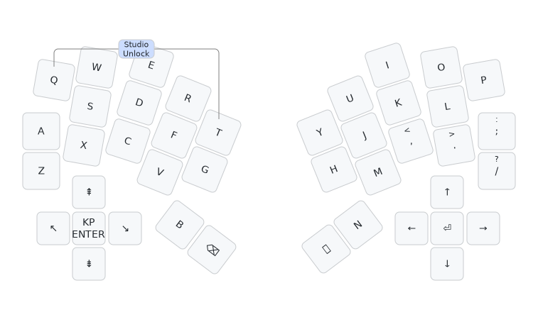

# Bivvy16D keyboard firmware

This is the default keymap which you would be expected to customise to your
needs with ZMK Studio or otherwise:

This is firmware for a split 30, 31, or 32 key design (Visorbearer like layout),
with a 5-way directional button on each half,
my [Bivvy16D keyboard](https://codeberg.org/peterjc/pico-keyboards/src/branch/main/bivvy16d).
This is a *diode-free* design with a sparse 9 by 8 scanning matrix designed using
Graph Theory to avoid ghosting. See this
[blog post](https://astrobeano.blogspot.com/2025/05/topology-meets-custom-keyboard-circuit.html)
for background.

This matrix shows the 9×8 bipartite scanning matrix for either half, with the Raspberry Pi
"Zero" controller GPIO pins. The pin allocation was arbitrary and down to how easy it was to
layout the PCB traces:

| GP |  1 |  5 | 10 |  7 |  4 | 14 | 26 | 28 |
|---:|:--:|:--:|:--:|:--:|:--:|:--:|:--:|:--:|
|  2 | QP | WO |    |    |    |    |    |    |
|  6 |    | SL | X. |    |    |    |    |    |
|  8 |    |    | C, | DK |    |    |    |    |
|  3 |    |    |    | EI | RU |    |    |    |
|  9 |    |    |    |    | FJ | VM |    |    |
| 15 |    |    |    |    |    | GH | TY |    |
| 29 |    |    |    |    |    |    | ⌫␠ | BN |
|  0 | A; |    |    |    |    |    |    | Z/ |
| 27 | ⬇️ | ⬆️ |    | ⏺️ |    | ➡️ | ⬅️ |    |

Here is the matrix again, but for the NRF52840 SuperMini "Zero" controller (pads for this
are on the other side of the PCB - these 17 GPIOs are co-located):

| GP | RX |  5 | 13 | 10 |  4 | A0 | A2 | A4 |
|---:|:--:|:--:|:--:|:--:|:--:|:--:|:--:|:--:|
|  2 | QP | WO |    |    |    |    |    |    |
|  6 |    | SL | X. |    |    |    |    |    |
| 11 |    |    | C, | DK |    |    |    |    |
|  3 |    |    |    | EI | RU |    |    |    |
| 12 |    |    |    |    | FJ | VM |    |    |
| A1 |    |    |    |    |    | GH | TY |    |
| A5 |    |    |    |    |    |    | ⌫␠ | BN |
| TX | A; |    |    |    |    |    |    | Z/ |
| A3 | ⬇️ | ⬆️ |    | ⏺️ |    | ➡️ | ⬅️ |    |

The keys here are labeled as per Qwerty, with ⌫ (backspace) and ␠ (space) on the
thumbs, plus ⬆️/⬇️/⬅️/➡️/⏺️ as the directional button (for each half).

| Q  | W  | E  | R  | T  |   | Y  | U  | I  | O  | P  |
|:--:|:--:|:--:|:--:|:--:|:-:|:--:|:--:|:--:|:--:|:--:|
| A  | S  | D  | F  | G  |   | H  | J  | K  | L  | -  |
| Z  | X  | C  | V  | B  |   | N  | M  | ,  | .  | /  |
| ⬆️ | ⬇️ | ⬅️ | ➡️ | ⏺️ |   | ⏺️ | ⬅️ | ➡️ | ⬇️ | ⬆️ |
|    |    |    |    | ⌫  |   | ␠  |    |    |    |    |

This minimal default 32-key layout is rendered as an image above. The layout variants
drop either or both of the central thumbs (most splayed, backspace and space in the
default layout) which are listed last above - in favour of a single 1.75u wide thumb key.

The ZMK Studio unlock combo is Q (top left) and P (top right).

See also the [QMK Bivvy16D firmware](https://github.com/peterjc/qmk_userspace/tree/main/keyboards/bivvy16d),
the [Heawood42 keyboard](https://github.com/triliu/Heawood42) which was the first no-diode
keyboard using graph theory (42 key split design), and the later 56-key monoblock
[JESK56 keyboard](https://github.com/triliu/JESK56).
