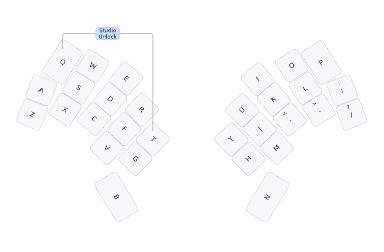

# Rugby Union "Fly Half" keyboard firmware

This is the default keymap which you would be expected to customise to your needs
with ZMK Studio or otherwise:

This is firmware for using my direct-wired (one GPIO per key) Bluetooth wireless 30 key
[Rugby Union "Fly Half" keyboard](https://codeberg.org/peterjc/pico-keyboards/src/branch/main/fly_half)
if built with two Super Mini NRF52840 "Zero" controllers.

This matrix shows the 2×15 scanning matrix. The two rows are the left and right
halves, and the 15 columns are the GPIO pins (from outer corner to thumb).

|R/C|C0 |C1 |C2 |C3 |C4 |C5 |C6 |C7 |C8 |C9 |C10|C11|C12|C13|C14|
|--:|:-:|:-:|:-:|:-:|:-:|:-:|:-:|:-:|:-:|:-:|:-:|:-:|:-:|:-:|:-:|
|R0 | Q | W | E | R | T | A | S | D | F | G | Z | X | C | V | B |
|R1 | Y | U | I | O | P | ; | L | K | J | H | / | . | , | M | N |

The keys here are labeled as per Qwerty, with B and N for the thumbs,

| Q | W | E | R | T |       | Y | U | I | O | P |
|:-:|:-:|:-:|:-:|:-:|:-----:|:-:|:-:|:-:|:-:|:-:|
| A | S | D | F | G |       | H | J | K | L | ; |
| Z | X | C | V | B |       | N | M | , | . | / |

This minimal default layout is rendered as an image above.

The ZMK Studio unlock combo is Q (top left) and T (top right of left half).
