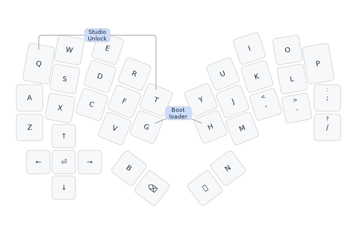

# Goldilocks32 keyboard firmware

This is the default keymap which you would be expected to customise to your needs
with ZMK Studio or otherwise:

This is firmware for a Raspberry Pi PR2040 (or potentially RP2350) 'Pro Micro' controller
tented monoblock 32 key design, my [Goldilocks32 keyboard](https://codeberg.org/peterjc/pico-keyboards/src/branch/main/goldilocks32).

This is a *diode-free* design with a sparse 9 by 16 scanning matrix designed using this
[25 vertex mostly girth 8 graph with 37 edges](https://houseofgraphs.org/graphs/56260).
Excluding the degree 5 vertex used for the 5-way navigation button, that becomes a sparse
8 by 16 scanning matrix using this [24 vertex girth 8 graph of maximal 32 edges](https://houseofgraphs.org/graphs/54531)
(using 24 vertices or GPIO pins, with 32 edges or keys with 6KRO - see this
[blog post](https://astrobeano.blogspot.com/2025/05/topology-meets-custom-keyboard-circuit.html)
for background, and this more recent
[blog post](https://astrobeano.blogspot.com/2025/12/5-way-switch-in-diode-free-graph-theory.html)
for the navigation button addition (as done in my [Bivvy16D](../bivvy16d) keyboard.

This matrix shows the 9×16 sparse bipartite scanning matrix. The keys are assigned so the
scanning column order matches the physical columns (starting with Q and A as the first
column), with the scanning rows sorted to ensure Q is top left as the first matrix entry.
The allocation of keys to matrix elements and scanning matrix rows and columns
to GPIO pins was arbitrary and down to how easy it was to layout the PCB traces:

| GP | 28 | 22 | 15 |  7 |  2 | 26 | 12 |   5  |   4   | 14 | 27 |  3 | 13 |  9 | 20 | 29 |
|---:|:--:|:--:|:--:|:--:|:--:|:--:|:--:|:----:|:-----:|:--:|:--:|:--:|:--:|:--:|:--:|:--:|
| 21 |  Q |  W |  E |  R |    |    |    |      |       |    |    |    |    |    |    |    |
| 11 |  A |    |    |    |    |  X |    |      |       |    |    |    |    |  K |  L |    |
| 16 |    |  S |    |    |    |    |  C |      |   N   |    |    |    |    |    |    |  P |
| 23 |    |    |  D |    |    |    |    |   B  |       |  , |  . |    |    |    |    |    |
|  0 |    |    |    |  F |  T |    |    |      |       |    |    |  H |  J |    |    |    |
| 10 |    |    |    |    |    |    |    |      | Space |  M |    |    |  U |    |  0 |    |
|  1 |    |    |    |    |    |    |    |      |       |    |  / |  Y |    |  I |    |  ; |
|  8 |    |    |    |    |  G |  Z |  V | BkSp |       |    |    |    |    |    |    |    |
|  6 |    |    |    | ⬇️ |    |    | ⬅️ |  ➡️  |       |    |    |    | ⬆️ | ⏺️ |    |    |

Note (aside from the bottom row for the navigation button) there are four entries for each
row, and two for each column.
The keys here are labeled as per Qwerty, with B, backspace, space and N for the thumbs,
and up/down/left/right/push as ⬆️/⬇️/⬅️/➡️/⏺️ for the navigation button.

| Q | W | E | R | T |       |       | Y | U | I | O | P |
|:-:|:-:|:-:|:-:|:-:|:-----:|:-----:|:-:|:-:|:-:|:-:|:-:|
| A | S | D | F | G |       |       | H | J | K | L | - |
| Z | X | C | V |   |       |       |   | M | , | . | / |
|   |   |   |   | B | BkSpc | Space | N |   |   |   |   |

This minimal default layout is rendered as an image above.

If you are using a single thumb key, this is electrically the same as the more tucked
thumb (B or N by default).

The ZMK Studio unlock combo is Q (top left) and T (top right of left half).

See also the [QMK Goldilocks32 firmware](https://github.com/peterjc/qmk_userspace/tree/main/keyboards/goldilocks32),
the [Heawood42 keyboard](https://github.com/triliu/Heawood42) which was the first no-diode
keyboard using graph theory (42 key split design), and the later 56-key monoblock
[JESK56 keyboard](https://github.com/triliu/JESK56).
