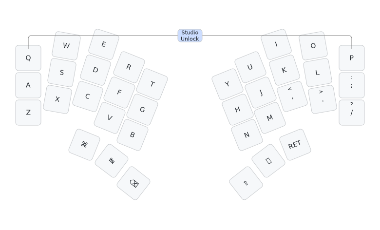

# Gamma-Omega Hesse keyboard firmware

This is firmware for a Bluetooth capable Nice!Nano v2 or Supermini nRF25840 (aka
ProMicro52840) controller monoblock 36 key design (split 3x5_3 - three rows of five,
and three thumb keys, for each hand): the
[Gamma Omega Hesse keyboard](https://github.com/unspecworks/gamma-omega/tree/main/hesse).
This is a *diode-free* design with a sparse 9 by 12 scanning matrix designed using the
[Hesse Configuration Incidence Graph](https://houseofgraphs.org/graphs/44164) (using
all 21 GPIO pins). This is a bipartite graph with 9 (scanning rows) plus 12 (scanning
columns) giving 21 vertices, and 36 edges (keys). The graph is girth 6, meaning sadly
the keyboard has only 4-key roll-over. See this
[blog post](https://astrobeano.blogspot.com/2025/05/topology-meets-custom-keyboard-circuit.html)
for background.

This matrix shows the full 9×12 Hesse Configuration Incidence Graph bipartite
scanning matrix. The allocation of keys to matrix elements and scanning matrix rows
and columns to GPIO pins was arbitrary and down to how easy it was to layout the PCB
traces:

| GPIO| D8 | D7 | D1 | D2 | D6 | D9 | 1.07 | D15 | D18 | D19 | 1.01 | 1.02 |
|:----|:--:|:--:|:--:|:--:|:--:|:--:|:----:|:---:|:---:|:---:|:----:|:----:|
| D0  |  Q |  W |  E |  R |    |    |      |     |     |     |      |      |
| D10 |  Z |    |    |    |  B | L3 |  R1  |     |     |     |      |      |
| D4  |  A |    |    |    |    |    |      |  H  |  U  |  ,  |      |      |
| D3  |    |  S |    |    |  G |    |      |  Y  |     |     |   L  |      |
| D16 |    |  X |    |    |    | L1 |      |     |  M  |     |      |   ;  |
| D14 |    |    |  C |    |    |    |  R2  |  N  |     |     |      |   /  |
| D21 |    |    |  D |    |    | L2 |      |     |     |  I  |   O  |      |
| D5  |    |    |    |  V |    |    |  R3  |     |  J  |     |   .  |      |
| D20 |    |    |    |  F |  T |    |      |     |     |  K  |      |   P  |

The keys here are labeled as per Qwerty, with L3, L2, L1, R1, R2, and R3 for the thumbs:

| Q | W |  E |  R |  T |   |  Y |  U |  I | O | P |
|:-:|:-:|:--:|:--:|:--:|:-:|:--:|:--:|:--:|:-:|:-:|
| A | S |  D |  F |  G |   |  H |  J |  K | L | ; |
| Z | X |  C |  V |  B |   |  N |  M |  , | . | / |
|   |   | L3 | L2 | L1 |   | R1 | R2 | R3 |   |   |

See also the [ZMK TC36K firmware](../hesse/),
[QMK TC36K firmware](https://github.com/peterjc/qmk_userspace/tree/main/keyboards/tutte_coxeter_36k),
the [Heawood42 keyboard](https://github.com/triliu/Heawood42) which was the first no-diode
keyboard using graph theory (42 key split design), and the later 56-key monoblock
[JESK56 keyboard](https://github.com/triliu/JESK56).

As an example of the potential issues with girth 6, the Python script
[roll-over.py](roll-over.py) enumerates the cycles of 6 edges where only
four keys can be distinguished. I thought any with two or more on the left
or right home-rows (`ASDF` or `JKL;`), or using both a left and a right
thumb might be problematic. None *seemed* to be, touch wood.

As an example, consider the `WEDOLS` chain:
* Column GPIO `D7`
* Qwerty key `W`
* Row GPIO `D0`
* Qwerty key `E`
* Column GPIO `D1`
* Qwerty key `D`
* Row GPIO `D2`
* Qwerty key `O`
* Column GPIO `P1.01`
* Qwerty key `L`
* Row GPIO `D3`
* Qwerty key `S`
* Back to column GPIO `D7`

I don't plan to use the block of four neighbouring keys `WE` above `SD`.
I do use the left-hand home row `SD` and the top row `WE` as combos,
and the vertical left hand combos `WS` and `ED`, but not together with
the right hand vertical combo `OL`. So I don't expect to press any five
of these at once (and get the sixth as a ghost keypress).

