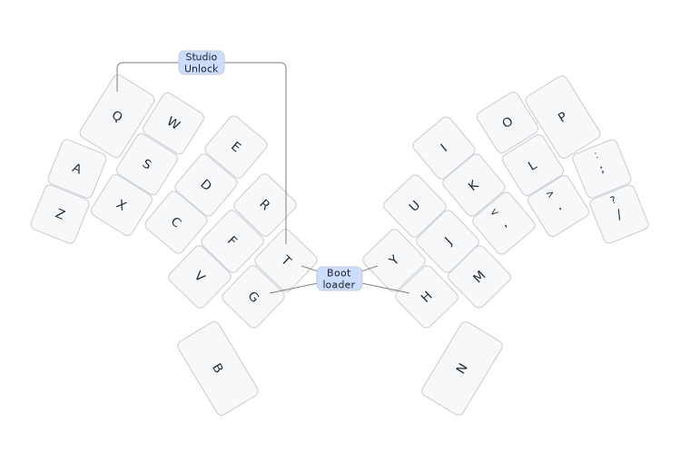

# Rugby Union keyboard firmware

This is the default keymap which you would be expected to customise to your needs
with ZMK Studio or otherwise:

This is firmware for a Raspberry Pi PR2040 (or potentially RP2350) 'Pro Micro' controller
tented monoblock 30 key design, my [Rugby Union keyboard](https://codeberg.org/peterjc/pico-keyboards/src/branch/main/rugby_union).

This is a *diode-free* design with a sparse 10 by 15 scanning matrix designed using this
[25 vertex girth 10 graph with 30 edges](https://houseofgraphs.org/graphs/45469).
That translates using 25 GPIO pins for 30 keys with 8KRO - see this
[blog post](https://astrobeano.blogspot.com/2025/05/topology-meets-custom-keyboard-circuit.html)
for background.

This matrix shows the 10×15 sparse bipartite scanning matrix. The keys are assigned so the
scanning column order matches the physical columns (starting with Q, A and Z as the first
column), with the scanning rows sorted to ensure Q is top left as the first matrix entry.
The allocation of keys to matrix elements and scanning matrix rows and columns
to GPIO pins was arbitrary and down to how easy it was to layout the PCB traces:

|R/C|C0 |C1 |C2 |C3 |C4 |C5 |C6 |C7 |C8 |C9 |
|--:|:-:|:-:|:-:|:-:|:-:|:-:|:-:|:-:|:-:|:-:|
|R0 | Q | W |   |   |   |   |   |   |   |   |
|R1 |   | S | E |   |   |   |   |   |   |   |
|R2 |   |   | D | R |   |   |   |   |   |   |
|R3 |   |   |   | F | T |   |   |   |   |   |
|R4 | A |   |   |   | G |   |   |   |   |   |
|R5 | Z |   |   |   |   | Y |   |   |   |   |
|R6 |   | X |   |   |   |   |   | I |   |   |
|R7 |   |   | C |   |   |   |   |   |   | P |
|R8 |   |   |   | V |   |   | U |   |   |   |
|R9 |   |   |   |   | B |   |   |   | O |   |
|R10|   |   |   |   |   | H | J |   |   |   |
|R11|   |   |   |   |   |   | M | K |   |   |
|R12|   |   |   |   |   |   |   | , | L |   |
|R13|   |   |   |   |   |   |   |   | . | ; |
|R14|   |   |   |   |   | N |   |   |   | / |

Note there are two entries for each row, and three for each column.
The keys here are labeled as per Qwerty, with B and N for the thumbs,

| Q | W | E | R | T |       | Y | U | I | O | P |
|:-:|:-:|:-:|:-:|:-:|:-----:|:-:|:-:|:-:|:-:|:-:|
| A | S | D | F | G |       | H | J | K | L | - |
| Z | X | C | V | B |       | N | M | , | . | / |

This minimal default layout is rendered as an image above.

The ZMK Studio unlock combo is Q (top left) and T (top right of left half).

See also the [QMK Rugby Union firmware](https://github.com/peterjc/qmk_userspace/tree/main/keyboards/rugby_union),
the [Heawood42 keyboard](https://github.com/triliu/Heawood42) which was the first no-diode
keyboard using graph theory (42 key split design), and the later 56-key monoblock
[JESK56 keyboard](https://github.com/triliu/JESK56).
