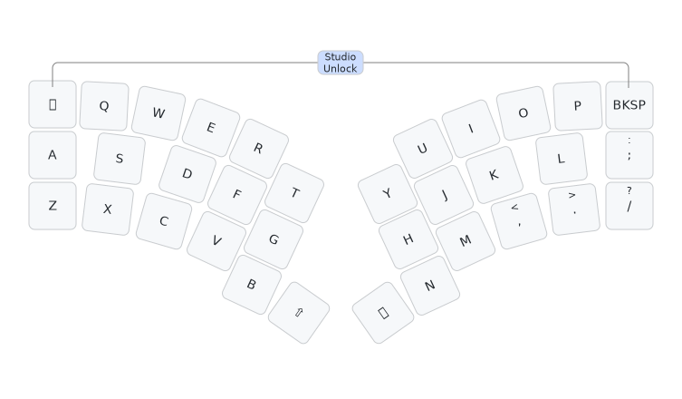

# Slump34t keyboard firmware

This is the default keymap which you would be expected to customise to your needs
with ZMK Studio or otherwise:

This is firmware for a Raspberry Pi PR2040 or RP2350 'Zero' controller tented
monoblock 34 key design (split 3x5 - three rows of five, with one thumb key and
one top corner key per hand), my [curvy Slump34t keyboard](https://codeberg.org/peterjc/pico-keyboards/src/branch/main/slump34t).
This is a *diode-free* design with a sparse 10 by 10 scanning matrix designed using the
[unique 20 vertex girth 6 graph of maximal 34 edges](https://houseofgraphs.org/graphs/55819)
(using only 20 vertices or GPIO pins, with 34 edges or keys with 4KRO- see this
[blog post](https://astrobeano.blogspot.com/2025/05/topology-meets-custom-keyboard-circuit.html)
for background.

This matrix shows the 10×10 sparse bipartite scanning matrix in Paige-Wexler
normal form. The keys are assign so the scanning column order matches the physical
columns (starting with Escape, A, Z, tab as the first column), with the scanning
rows sorted to ensure Escape is top left as the first matrix entry.
The allocation of keys to matrix elements and scanning matrix rows and columns
to GPIO pins was arbitrary and down to how easy it was to layout the PCB traces:

| GP |  29 | 14 | 10 | 6 |   1   |   0   | 3 | 9 | 13 |  28  |
|---:|:---:|:--:|:--:|:-:|:-----:|:-----:|:-:|:-:|:--:|:----:|
| 11 | Esc |  W |  E | R |       |       |   |   |    |      |
| 15 |  Q  |    |    |   |   T   |       |   |   |  O |      |
| 26 |  A  |    |    |   |       | Space |   | I |    | BkSp |
| 27 |  Z  |    |    |   |       |       | U |   |    |      |
| 12 |     |  S |    |   |   G   |       | J | K |    |      |
|  7 |     |    |  D |   |       |   Y   | M |   |  L |      |
|  2 |     |    |    | F |   B   |   H   |   |   |    |      |
|  8 |     |    |  C |   | Shift |       |   |   |    |   P  |
|  5 |     |  X |    |   |       |   N   |   |   |    |   ;  |
|  4 |     |    |    | V |       |       |   | , |  . |   /  |

The keys here are labeled as per Qwerty, with T1, T2, and T3, for the thumbs,
plus the cursors (in a standard inverted-tee layout, not a row):

| Esc |  Q  | W | E | R | T |       |       | Y | U | I | O | P | BkSp |
|:---:|:---:|:-:|:-:|:-:|:-:|:-----:|:-----:|:-:|:-:|:-:|:-:|:-:|:----:|
|     |  A  | S | D | F | G |       |       | H | J | K | L | - |      |
|     |  Z  | X | C | V | B | Shift | Space | N | M | , | . | / |      |

This minimal default layout is rendered as an image above.

The ZMK Studio unlock combo is Escape (top left) and Backspace (top right).

See also the [QMK Slump34t firmware](https://github.com/peterjc/qmk_userspace/tree/main/keyboards/slump34t),
the [Heawood42 keyboard](https://github.com/triliu/Heawood42) which was the first no-diode
keyboard using graph theory (42 key split design), and the later 56-key monoblock
[JESK56 keyboard](https://github.com/triliu/JESK56).
